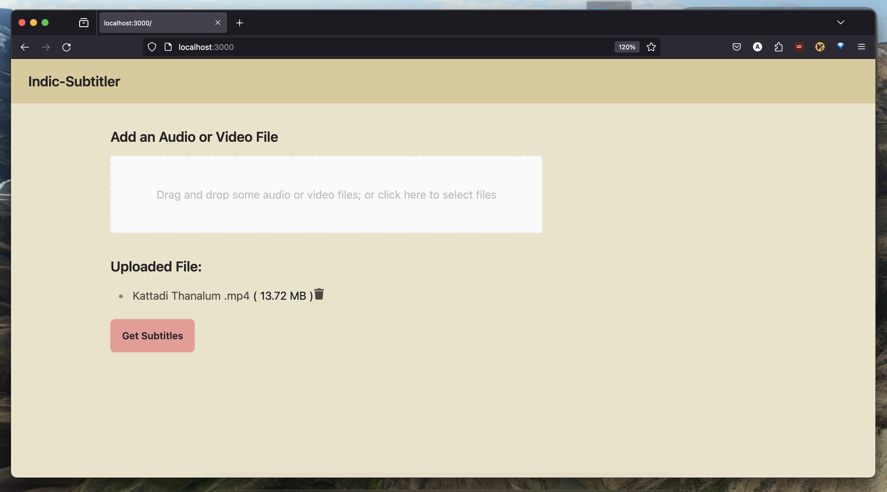

# UI for Indic-Subtitler




## Tech Stack

- Next.Js
- TailwindCSS
- DaisyUI
- Tailwind Forms

This directory contains the frontend application for the Indic-Subtitler project, built with Next.js. It provides a user interface for uploading audio files, viewing transcriptions, and translations.

## Getting Started

### Prerequisites

- Node.js 12.0 or higher
- npm or yarn

### Installation

1. Clone the repository to your local machine.
2. Navigate to the `ui/` directory.
3. Install the required dependencies:


```bash
npm install
or
yarn install
```


## Running the Application

To start the development server, run:

```bash
npm run dev or
yarn dev
```


Open `http://localhost:3000` with your browser to see the result.

## Features

- **File Upload**: Users can upload audio files for transcription.
- **Transcription and Translation**: Displays the transcription of the uploaded audio and its translation in the selected language.

## Contributing

Contributions are welcome! Please feel free to submit a pull request.

## License

This project is licensed under the GPL-v2 LICENSE - see the [LICENSE](../LICENSE) file for details.
